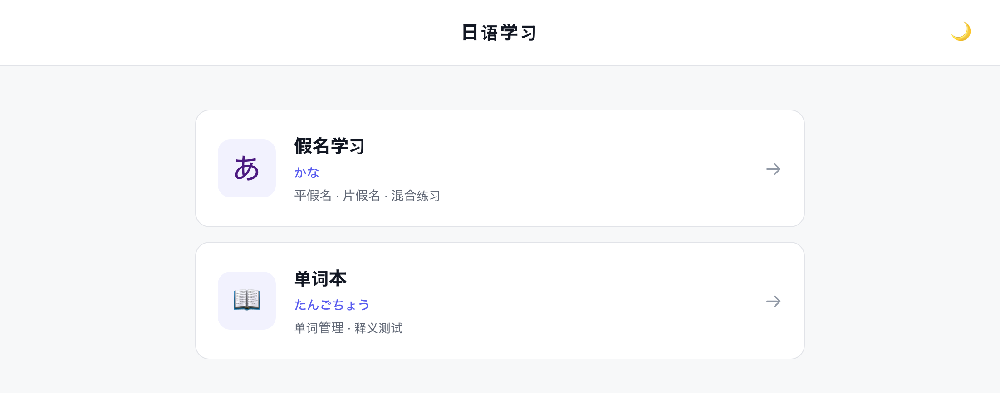
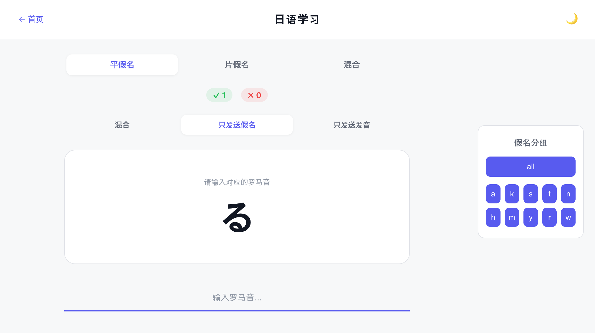
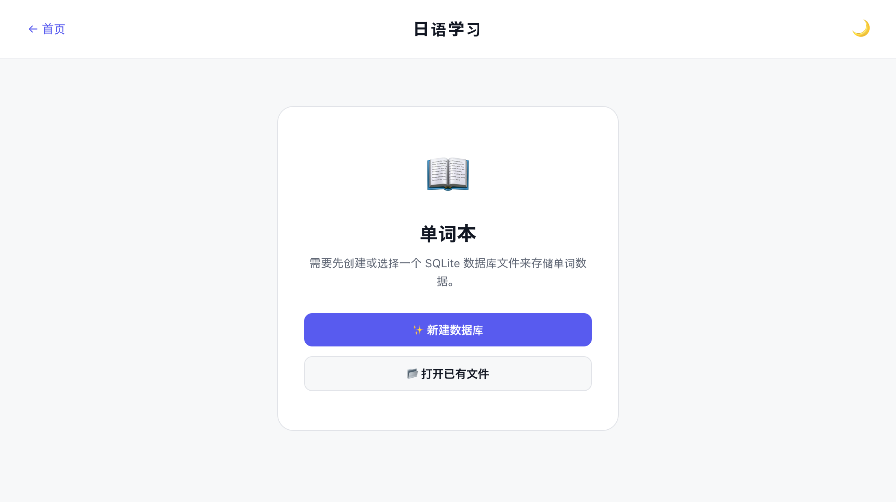
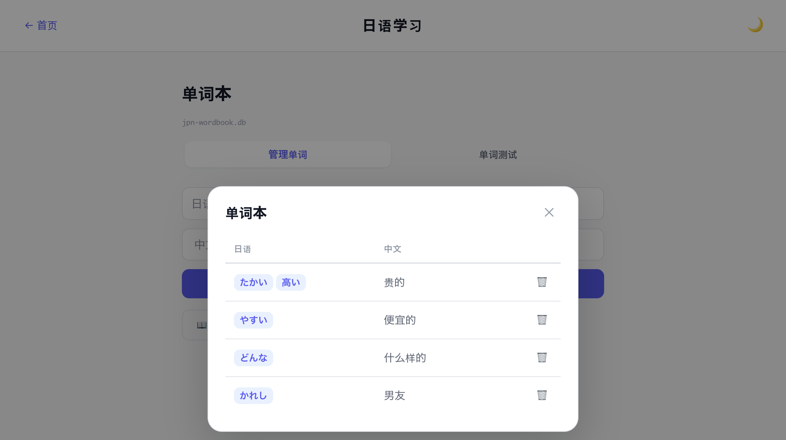
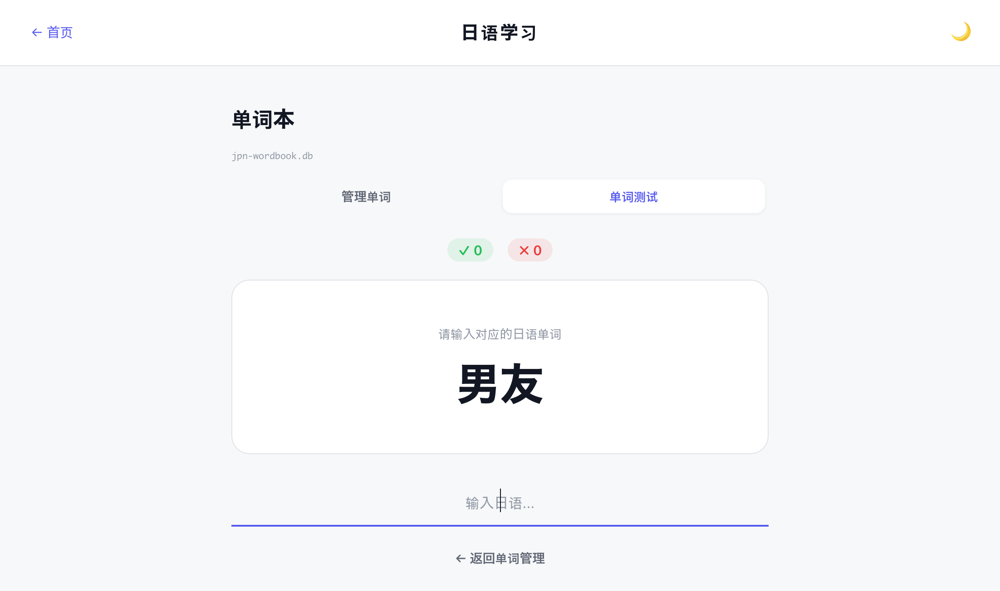

# 日本語学習

一个基于 React + Vite 构建的日语学习 Web 应用，包含假名练习和单词本两大模块。

## 特性

### 首页

进入应用后，首页提供两大学习模块的入口：**假名学习**和**单词本**。



### 假名学习

支持平假名、片假名以及混合模式练习，覆盖全部 46 个基础假名字符。

- **两种答题方式**：可以直接输入罗马音，也可以点击五十音图网格进行匹配
- **自适应难度**：答错的字符会以更高频率出现，帮助针对性强化薄弱点
- **反应时间追踪**：回答过慢会增加该字符的难度权重，激励快速回忆
- **分组筛选**：可按辅音组（あ、か、さ、た、な、は、ま、や、ら、わ）筛选特定行的假名
- **正确/错误计数**：实时显示答题统计
- **深色/浅色主题**：支持切换配色方案，偏好设置会持久保存



### 单词本

支持本地 SQLite 数据库文件（通过浏览器 File System Access API）持久化存储单词数据。

- **首次使用**：需要创建新数据库文件或打开已有文件，数据保存在本地磁盘
- **添加单词**：支持为同一日语单词添加多种写法（如汉字、假名等），用空格键确认每个写法标签；同时填写对应的中文释义
- **查看与编辑**：以表格形式展示所有单词，点击单元格即可内联编辑日语写法和中文释义
- **删除确认**：删除单词时会高亮该行并显示「取消」和「确认删除」按钮，避免误操作
- **单词测试**：随机抽取单词进行释义测试（日语↔中文双向出题），支持多种写法中任一答案为正确



首次进入单词本时，需要选择一个本地 SQLite 数据库文件来存储单词数据。点击「新建数据库」可创建新文件，点击「打开已有文件」可加载已有数据。



添加单词时，在日语输入框中输入写法后按空格键确认，支持添加多个变体。下方输入对应的中文释义，点击「添加」按钮保存。



测试模式下，随机抽取单词并以卡片形式展示日语或中文，输入对应的释义即可作答。支持双向出题，答对自动进入下一题。

## 快速开始

### 环境要求

- [Node.js](https://nodejs.org/)（v18 或以上）

### 安装

```bash
# 克隆仓库
git clone <repo-url>
cd learn-jap

# 安装依赖
npm install
```

### 开发

启动开发服务器（支持热更新）：

```bash
npm run dev
```

默认访问地址为 `http://localhost:5173`。

### 构建

```bash
npm run build
```

构建产物输出到 `dist/` 目录。

### 预览生产构建

```bash
npm run preview
```

## 技术栈

| 类别 | 技术 |
|------|------|
| 框架 | React 18 |
| 路由 | React Router v6 |
| 构建工具 | Vite 5 |
| 样式 | CSS（自定义属性实现主题切换） |
| 本地存储 | sql.js（浏览器端 SQLite） |

## 许可证

MIT

